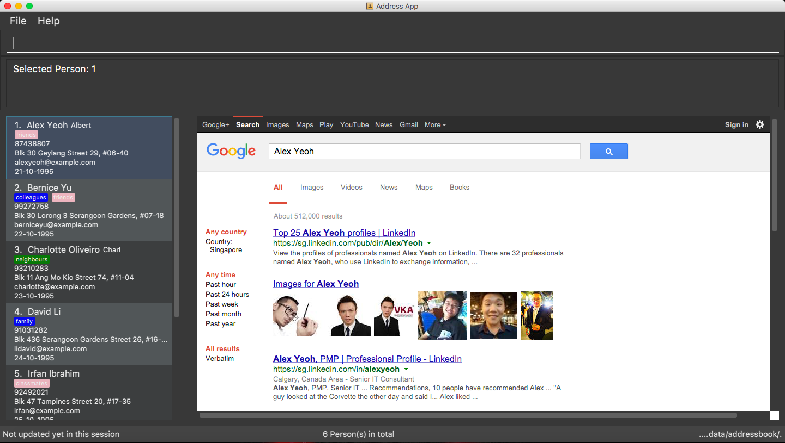

= iContacts
ifdef::env-github,env-browser[:relfileprefix: docs/]
ifdef::env-github,env-browser[:outfilesuffix: .adoc]

https://travis-ci.org/CS2103AUG2017-W14-B1/main[image:https://travis-ci.org/CS2103AUG2017-W14-B1/main.svg?branch=master[Build Status]]
https://ci.appveyor.com/project/tshradheya/main/branch/master[image:https://ci.appveyor.com/api/projects/status/c9bls1ru0n4vtcqm/branch/master?svg=true[Build status]]
https://coveralls.io/github/CS2103AUG2017-W14-B1/main[image:https://coveralls.io/repos/github/CS2103AUG2017-W14-B1/main/badge.svg[Coverage Status]]
https://www.codacy.com/app/justinpoh/main?utm_source=github.com&amp;utm_medium=referral&amp;utm_content=CS2103AUG2017-W14-B1/main&amp;utm_campaign=Badge_Grade[image:https://api.codacy.com/project/badge/Grade/481207cc97bf4a0fa8ea2a0ff18f10fb[Codacy Badge]]

ifdef::env-github[]

endif::[]

ifndef::env-github[]
image::images/Ui.png[width="600"]
endif::[]

* iContacts is a desktop Address Book application. It has a GUI but most of the user interactions happen using a CLI (Command Line Interface).
* iContacts is developed by a group of students as their project for the module CS2103T in NUS.
* This application was built upon the AddressBook-Level4 project povided by the https://github.com/se-edu/i[NUS SE-EDU initiative].

== Site Map

* <<UserGuide#, User Guide>>
* <<DeveloperGuide#, Developer Guide>>
* <<LearningOutcomes#, Learning Outcomes>>
* <<AboutUs#, About Us>>
* <<ContactUs#, Contact Us>>

== Acknowledgements

* Some parts of this sample application were inspired by the excellent http://code.makery.ch/library/javafx-8-tutorial/[Java FX tutorial] by
_Marco Jakob_.
* Original source of the code was obtained from AddressBook-Level4 project created by the https://github.com/se-edu/i[NUS SE-EDU initiative].

== Licence : link:LICENSE[MIT]

